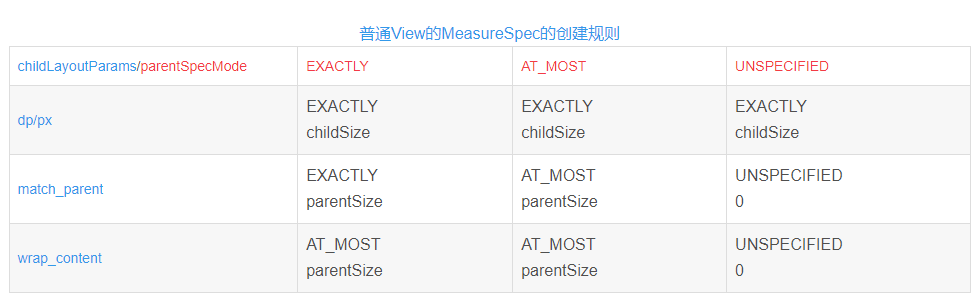

## 一、自定view的分类

- 继承自ViewGroup: 主要是重写onMeasure和onLayout

- 继承自View：主要从写onDraw

## 二、LayoutParams和MeasureSpec

### 2.1 LayoutParams

### 2.2 MeasureSpec

MeasureSpec是View中的一个内部类，基本都是二进制运算，由于int是32位，用高2位表示mode，低30位表示size，MODE_SHIFT = 30的作用是移位

#### 2.2.1 普通View的MeasureSpec的创建规则

普通View的MeasureSpec的创建规则

#### 2.2.2 MeasureSpec常用的三个函数：

- 1.static int getMode(int measureSpec):根据提供的测量值(格式)提取模式(上述三个模式之一)

- 2.static int getSize(int measureSpec):根据提供的测量值(格式)提取大小值(这个大小也就是我们通常所说的大小)

- 3.static int makeMeasureSpec(int size,int mode):根据提供的大小值和模式创建一个测量值(格式)

mode共有三种情况，取值分别为MeasureSpec.UNSPECIFIED, MeasureSpec.EXACTLY, MeasureSpec.AT_MOST

#### 2.2.3 MeasureSpec的取值

- MeasureSpec.EXACTLY是精确尺寸   
  当我们将控件的layout_width或layout_height指定为具体数值时如andorid:layout_width="50dip"
  ，或者为match_parent是，都是控件大小已经确定的情况，都是精确尺寸。
- MeasureSpec.AT_MOST是最大尺寸   
  当控件的layout_width或layout_height指定为WRAP_CONTENT时，控件大小一般随着控件的子空间或内容进行变化，此时控件尺寸只要不超过父控件允许的最大尺寸即可。
  因此，此时的mode是AT_MOST，size给出了父控件允许的最大尺寸。
- MeasureSpec.UNSPECIFIED是未指定尺寸   
  这种情况不多，一般都是父控件是AdapterView，通过measure方法传入的模式。

那么这些模式和我们平时设置的layout参数match_parent, wrap_content有什么关系呢？ 经过代码测试就知道，**
当我们设置width或height为match_parent时，容器在布局时调用子view的measure方法传入的模式是EXACTLY，因为子view会占据剩余容器的空间，所以它大小是确定的。
而当设置为 wrap_content时，容器传进去的是AT_MOST,
表示子view的大小最多是多少，这样子view会根据这个上限来设置自己的尺寸。当子view的大小设置为精确值时，容器传入的是EXACTLY,**
而MeasureSpec的UNSPECIFIED模式目前还没有发现在什么情况下使用。   
View的onMeasure方法默认行为是当模式为UNSPECIFIED时，设置尺寸为mMinWidth(通常为0)
或者背景drawable的最小尺寸，当模式为EXACTLY或者AT_MOST时，尺寸设置为传入的MeasureSpec的大小。
有个观念需要纠正的是，match_parent应该是子view会占据剩下容器的空间，而不会覆盖前面已布局好的其他view空间，当然后面布局子
view就没有空间给分配了，所以match_parent属性对布局顺序很重要。 在两种情况下，你必须绝对的处理这些限制。
在一些情况下，它可能会返回超出这些限制的尺寸，在这种情况下，你可以让父元素选择如何对待超出的View，使用裁剪还是滚动等技术。

